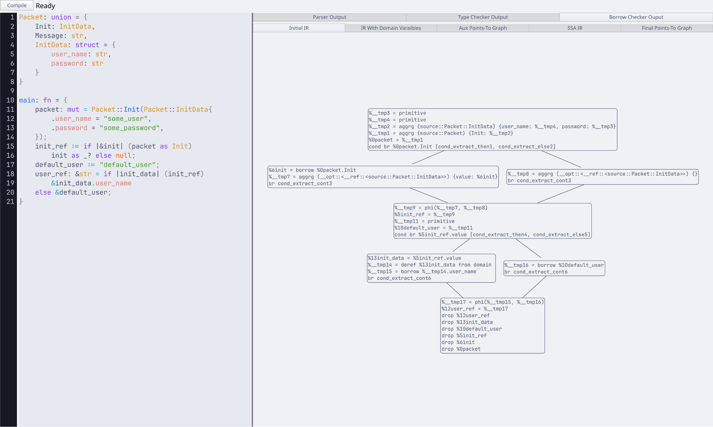

# Yoyo Viz

QtQuick application created to visualize the output of the compiler for the yoyo_viz
programming language, It is fairly buggy and might crash sometimes because some
states are not completely handled, but it works for the most part.

## Building

It uses meson so it should be straight-forward to build, as long as Qt is present.

```bash
meson setup builddir
cd builddir
meson compile
```

The executable should be present in builddir/yoyo_viz

## Example Screenshot


